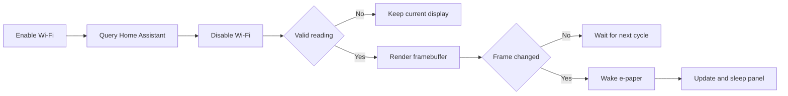

# RP2040 INK Display Home Assistant

A low-power environmental dashboard for Home Assistant built with a Raspberry Pi Pico W and a 2.13-inch WeActStudio tri-color e-paper display.

The firmware is written in C using the Raspberry Pi Pico SDK. It does not use Arduino or external graphics libraries. It retrieves indoor temperature, outdoor temperature, humidity, CO2, and PM2.5 values from the local Home Assistant REST API, and the last image remains visible even when the display is unpowered.


## Features

- UI optimized for a 250 x 122 pixel black, white, and red display.
- Timestamp of the latest reading received from Home Assistant.
- Outdoor temperature from a configurable Home Assistant entity.
- CO2 shown in red only above a configurable threshold.
- Wi-Fi enabled only while retrieving data.
- SSD1680 deep sleep after each display update.
- Last valid reading preserved if Wi-Fi or Home Assistant fails.
- Automatic selection between the initial full frame and differential windows.
- Recovery from `BUSY`, reset, and SPI transfer errors.
- Configurable USB diagnostic logs.
- Native framebuffer tests that run without hardware.

## Supported hardware

- Raspberry Pi Pico W based on RP2040.
- Raspberry Pi Pico 2 W through the `pico2_w` build target.
- WeActStudio 2.13-inch BWR E-Paper Module.
- GDEY0213Z98 panel with SSD1680 controller and 122 x 250 visible pixels.

The module must be configured for `4-Lines SPI`: `SB1` closed and `SB2` open.

## Wiring

| WeActStudio | Function | Pico W | Physical pin |
|---|---|---|---:|
| VCC | 3.3 V power | 3V3(OUT) | 36 |
| GND | Ground | GND | 23 |
| SDA | SPI0 TX / MOSI | GP19 | 25 |
| SCL | SPI0 SCK | GP18 | 24 |
| CS | SPI chip select | GP17 | 22 |
| DC | Data / command | GP20 | 26 |
| RES | Reset | GP21 | 27 |
| BUSY | Panel status | GP22 | 29 |

MISO is not connected. Power the display from 3.3 V only.

## Prerequisites

- [Raspberry Pi Pico SDK](https://github.com/raspberrypi/pico-sdk)
- Arm GNU Toolchain for `arm-none-eabi`
- CMake
- Ninja
- Optionally, `picotool`

Set the SDK location and make the compiler available in `PATH`:

```sh
export PICO_SDK_PATH=/path/to/pico-sdk
export PATH=/path/to/arm-gnu-toolchain/bin:$PATH
```

## Private configuration

Create the local configuration from the provided template:

```sh
cp src/config_local.example.h src/config_local.h
```

Edit `src/config_local.h`:

```c
#define APP_WIFI_SSID "my_wifi"
#define APP_WIFI_PASSWORD "my_password"
#define APP_HA_HOST "192.168.1.20"
#define APP_HA_PORT 8123
#define APP_HA_TOKEN "long_lived_access_token"
#define APP_HA_TEMPERATURE "sensor.temperature"
#define APP_HA_HUMIDITY "sensor.humidity"
#define APP_HA_CO2 "sensor.co2"
#define APP_HA_PM25 "sensor.pm25"
#define APP_HA_EXTERNAL_TEMPERATURE "sensor.external_temperature"
#define APP_REFRESH_SECONDS 300
```

All entity IDs are configured in this single block. They can point to any Home Assistant entities that expose numeric states.

### Display text

Every label shown on the e-paper display is configured in the same file:

```c
#define APP_UI_TITLE "INDOOR AIR"
#define APP_UI_UPDATED "ACT"
#define APP_UI_EXTERNAL_TEMPERATURE "EXT TEMP"
#define APP_UI_EXTERNAL_TEMPERATURE_UNIT "C"
#define APP_UI_CO2 "CO2"
#define APP_UI_CO2_UNIT "PPM"
#define APP_UI_TEMPERATURE "TEMP"
#define APP_UI_TEMPERATURE_UNIT "C"
#define APP_UI_HUMIDITY "HUM"
#define APP_UI_HUMIDITY_UNIT "%"
#define APP_UI_PM25 "PM2.5"
#define APP_UI_PM25_UNIT "UG/M3"
#define APP_CO2_RED_ABOVE 1000
```

`APP_CO2_RED_ABOVE` uses a strict comparison: with the default value, readings up to and including `1000 ppm` are black, while readings above `1000 ppm` are red.

The built-in font supports uppercase `A-Z`, digits, spaces, `.`, `:`, `%`, and `/`. Keep metric labels at 12 characters or fewer. The dashboard validates configuration limits before drawing to prevent text from overflowing the display.

Create a token from your Home Assistant profile under **Long-Lived Access Tokens**. Each configured entity must return a numeric state.

`config_local.h` is excluded from Git. The firmware never prints the SSID, Wi-Fi password, or Home Assistant token to the diagnostic log.

## Build

For Pico W:

```sh
./build.sh pico_w
```

For Pico 2 W:

```sh
./build.sh pico2_w
```

The resulting firmware is written to:

```text
build-pico_w/epaper_demo.uf2
```

## Flash

Hold `BOOTSEL`, connect the Pico over USB, and copy the UF2 file to the `RPI-RP2` drive.

You can also flash it with `picotool`:

```sh
picotool load -f -x build-pico_w/epaper_demo.uf2
```

## Test

Run the framebuffer and dashboard tests on the host computer:

```sh
./test.sh
```

USB logs are enabled by default. Build a lower-power version without the USB console with:

```sh
EPAPER_USB_LOGS=OFF ./build.sh pico_w
```

## Runtime flow



## Display updates

The firmware calculates the smallest changed region and transfers only that window. This reduces CPU work and SPI traffic.

The tri-color GDEY0213Z98 supports partial RAM addressing, but its SSD1680 runs a full-screen physical waveform for partial windows as well. On the tested hardware, `BUSY` remains active for approximately 18.2 seconds. This is a panel limitation rather than an SPI transport limitation.

## Architecture

| File | Responsibility |
|---|---|
| `src/epd.c` | SSD1680 protocol, SPI, reset, `BUSY`, and recovery |
| `src/epaper.c` | Display state and update selection |
| `src/frame.c` | Framebuffer, font, and drawing primitives |
| `src/dashboard.c` | UI composition and reading validation |
| `src/home_assistant.c` | Fixed-memory REST client with bounded timeouts |
| `src/wifi_session.c` | Wi-Fi lifecycle and radio shutdown |
| `src/app.c` | Orchestration, retry policy, and update schedule |
| `src/main.c` | Pin configuration and application startup |

Each color plane occupies 4,000 bytes. Command `0x24` controls black and command `0x26` controls red.

## Security

- Never publish `src/config_local.h`.
- Never distribute a UF2 built with real credentials because its strings are embedded in the binary.
- The current connection uses local HTTP. Do not expose the Home Assistant port `8123` to the Internet.
- Use a dedicated token and revoke it if the device is no longer under your control.
