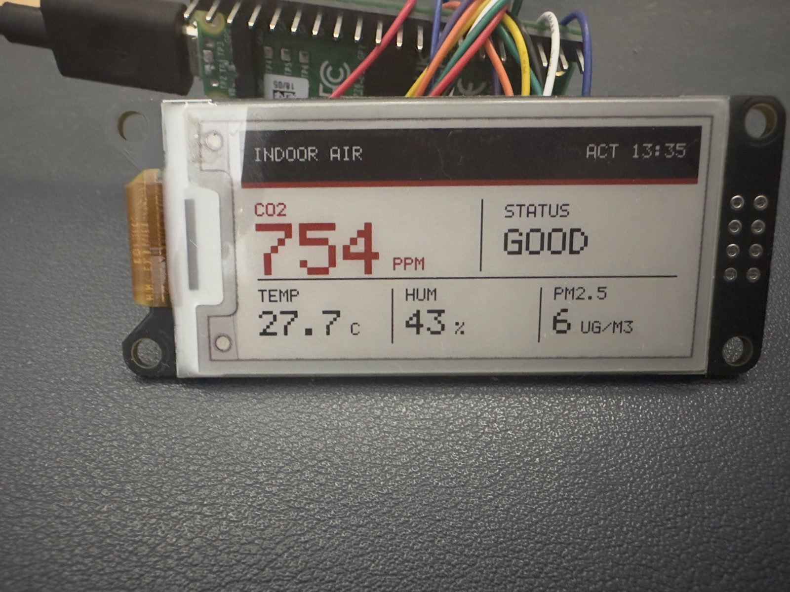

# Home Assistant Ink Display RPI Pico

A configurable Home Assistant dashboard for Raspberry Pi Pico W, Pico 2 W, and the WeActStudio 2.13-inch black, white, and red e-paper display.

No Arduino knowledge, C editing, Home Assistant token, or fixed entity list is required. A guided installer builds the UF2 with your Wi-Fi credentials, and every displayed entity is selected later from Home Assistant.



## What it does

- Shows one to four Home Assistant entities in each of two rows.
- Supports up to eight entities in total.
- Lets you configure entities, labels, units, decimal places, red thresholds, and positions from Home Assistant.
- Automatically resizes columns and values to fit the selected layout.
- Discovers the display automatically on the local network.
- Pairs using a six-digit code shown on the e-paper display.
- Does not store a Home Assistant access token.
- Refreshes the screen only after a configured entity changes.
- Groups changes using a minimum interval from 60 seconds to 24 hours.
- Uses five minutes as the default minimum interval.
- Turns Wi-Fi off between checks and puts the display controller into deep sleep after writing.
- Preserves the last image if Wi-Fi or Home Assistant is unavailable.

## What you need

- Raspberry Pi Pico W or Raspberry Pi Pico 2 W.
- WeActStudio 2.13-inch BWR E-Paper Module.
- Eight female-to-female jumper wires.
- A USB data cable.
- A 2.4 GHz Wi-Fi network.
- Home Assistant with [HACS](https://hacs.xyz) installed.
- A Windows, macOS, Ubuntu, Debian, or Raspberry Pi OS computer.

## 1. Check the display

The solder bridges on the back of the e-paper module must select `4-Lines SPI`:

- `SB1` closed.
- `SB2` open.

Only power the module from 3.3 V.

## 2. Connect the display

Disconnect USB power before changing wires.

| E-paper pin | Pico pin | Physical pin | Purpose |
|---|---|---:|---|
| VCC | 3V3(OUT) | 36 | 3.3 V power |
| GND | GND | 23 | Ground |
| SDA | GP19 | 25 | SPI data |
| SCL | GP18 | 24 | SPI clock |
| CS | GP17 | 22 | Chip select |
| DC | GP20 | 26 | Data or command |
| RES | GP21 | 27 | Display reset |
| BUSY | GP22 | 29 | Display status |

Pico W and Pico 2 W use the same wiring. MISO is not connected.

## 3. Download the project

Select **Code → Download ZIP** on GitHub and extract the ZIP file.

Advanced users can clone it instead:

```sh
git clone https://github.com/pedromartinezweb/Home-Assistant-Ink-Display-RPI-Pico.git
cd Home-Assistant-Ink-Display-RPI-Pico
```

## 4. Create your UF2

The setup tool checks the required compiler and build tools. If something is missing, it asks the operating system to install it and downloads the official Raspberry Pi Pico SDK into this project.

### Windows

Double-click `setup.bat`.

Windows may ask for permission while Windows Package Manager installs Git, CMake, Ninja, and the Arm compiler.

### macOS

Double-click `setup.command`.

If macOS blocks it, right-click the file, select **Open**, and confirm. Homebrew is installed automatically when required.

### Ubuntu, Debian, or Raspberry Pi OS

Open a terminal inside the extracted project folder and run:

```sh
chmod +x setup.sh
./setup.sh
```

The installer asks for:

1. Pico W or Pico 2 W.
2. Your Wi-Fi name.
3. Your Wi-Fi password, which is hidden while typing.

Home Assistant address and credentials are not requested. Pairing supplies the required local connection automatically.

The finished file is placed in `firmware`:

```text
firmware/ha_ink_display-pico_w.uf2
```

The installer then asks whether it should upload the firmware to a connected Pico. It uses `picotool` when available and also supports a Pico already connected in BOOTSEL mode.

The Wi-Fi configuration file and generated UF2 are excluded from Git. Do not share the UF2 because it contains your Wi-Fi credentials.

## 5. Install the UF2

If the setup tool reports that it uploaded the firmware successfully, continue directly to the next section.

1. Disconnect the Pico from USB.
2. Hold the `BOOTSEL` button.
3. Connect USB while holding the button.
4. Release it when a drive named `RPI-RP2` appears.
5. Copy the generated UF2 to `RPI-RP2`.
6. Wait for the Pico to restart.

The e-paper display performs a complete cleaning cycle and then shows a six-digit pairing code.

## 6. Install the Home Assistant integration

1. Open HACS in Home Assistant.
2. Open **Integrations**.
3. Open the menu in the top-right corner and select **Custom repositories**.
4. Enter:

   ```text
   https://github.com/pedromartinezweb/Home-Assistant-Ink-Display-RPI-Pico
   ```

5. Select the **Integration** category and add it.
6. Search for **Home Assistant Ink Display** and install it.
7. Restart Home Assistant.

## 7. Pair and configure the display

After restarting Home Assistant:

1. Open **Settings → Devices & services**.
2. The discovered **Home Assistant Ink Display** should appear automatically.
3. Select **Add**.
4. Enter the six-digit code shown on the e-paper display.
5. Choose the number of elements in row 1 and row 2.
6. Choose the minimum update interval. The default is 300 seconds.
7. Select an entity and display options for every position.

For each position, Home Assistant asks for:

| Setting | Meaning |
|---|---|
| Entity | The Home Assistant value to display |
| Label | Short uppercase name shown on the display |
| Custom unit | Leave empty to use the entity unit automatically |
| Decimal places | Zero, one, or two |
| Red threshold | Leave empty for black; enter an integer to use red above that value |

If automatic discovery does not appear, select **Add integration**, search for **Home Assistant Ink Display**, and enter the Pico IP address. The default pairing port is `8088`.

## How updates work

Home Assistant watches only the configured entities. When one changes, the integration keeps the newest combined dashboard state.

The Pico briefly enables Wi-Fi at the selected interval:

- If no configured entity changed, the display remains asleep.
- If one or more entities changed, the Pico downloads one signed frame and refreshes once.
- Several changes during the interval are combined into the same refresh.
- If a value is unavailable or not numeric, its cell shows `N/A`.

The minimum interval protects the tri-color e-paper panel from continuous updates. It cannot be configured below 60 seconds. A five-minute interval is recommended for environmental sensors.

## Change the layout later

Open **Settings → Devices & services → Home Assistant Ink Display**, select **Configure**, and repeat the layout steps. The next Pico check receives the new layout automatically; no new UF2 is needed.

## Pair again or change Wi-Fi

Run the setup tool again and install the newly generated UF2. Each build receives a new provisioning identifier, clears the previous pairing, and shows a new code.

## Common problems

| Problem | What to check |
|---|---|
| The installer cannot install tools | Confirm Internet access and accept the administrator prompt |
| No `RPI-RP2` drive appears | Use a USB data cable and hold `BOOTSEL` before connecting USB |
| The display never changes | Check every wire, 3.3 V power, and the `SB1`/`SB2` SPI setting |
| A pairing code appears but Home Assistant finds nothing | Confirm both devices use the same LAN and that mDNS is not blocked |
| Pairing fails | Enter the current six-digit code before restarting the Pico |
| Home Assistant reports that local HTTP is required | Configure an internal Home Assistant URL using local HTTP |
| A cell shows `N/A` | The entity is unavailable, unknown, or does not contain a numeric state |
| The screen flashes several colors | This is the normal full waveform of the tri-color e-paper panel |

## Security model

- Wi-Fi credentials remain in the local untracked configuration and generated UF2.
- The Pico never receives a Home Assistant user token.
- Pairing requires physical access to the code on the display.
- Pairing creates a random 256-bit device secret.
- Home Assistant signs every frame with HMAC-SHA256.
- Poll requests and display frames are authenticated with HMAC-SHA256, so the device secret is not sent during normal updates.
- Communication remains on the local network.

## Printable enclosure

The [`enclosure`](enclosure/) folder contains a ready-to-slice STL, editable OpenSCAD source, and assembly instructions.

## Development

Run the native framebuffer and protocol tests:

```sh
./test.sh
```

Build manually:

```sh
export PICO_SDK_PATH=/path/to/pico-sdk
./build.sh pico_w
```

The repository contains:

| Path | Responsibility |
|---|---|
| `src` | Pico W and Pico 2 W firmware |
| `custom_components/ha_ink_display` | HACS-compatible Home Assistant integration |
| `tests` | Native protocol and rendering tests |
| `enclosure` | Printable enclosure and OpenSCAD source |
| `setup.sh` | macOS and Linux guided installer |
| `setup.ps1` | Windows guided installer |

## Original project

This project is based on [RP2040 INK Display Home Assistant](https://github.com/pedromartinezweb/RP2040-INK-Display-Home-Assistant), whose original firmware established the SSD1680 driver, stable complete refresh sequence, low-power lifecycle, and responsive two-row renderer.

## Hardware references

- [WeActStudio E-Paper Module](https://github.com/WeActStudio/WeActStudio.EpaperModule)
- [Raspberry Pi Pico W documentation](https://pip.raspberrypi.com/categories/686-raspberry-pi-pico-w)
- [Raspberry Pi Pico C/C++ SDK](https://github.com/raspberrypi/pico-sdk)
