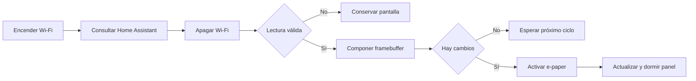

# RP2040 INK Display Home Assistant

Panel ambiental de bajo consumo para Home Assistant construido con una Raspberry Pi Pico W y una pantalla de tinta electrónica tricolor WeActStudio de 2,13 pulgadas.

El firmware está escrito en C sobre Raspberry Pi Pico SDK. No usa Arduino ni bibliotecas gráficas externas. Obtiene temperatura, humedad, CO₂ y PM2.5 mediante la API REST local de Home Assistant y conserva la última imagen aunque la pantalla quede sin alimentación.

## Características

- Interfaz optimizada para 250 × 122 píxeles en negro, blanco y rojo.
- Hora de la última lectura recibida desde Home Assistant.
- Estado automático del CO₂: `BUENO`, `MEDIO` o `ALTO`.
- Wi-Fi activo únicamente durante la consulta de datos.
- Reposo del controlador SSD1680 después de cada actualización.
- Conservación de la última lectura si falla Wi-Fi o Home Assistant.
- Selección automática entre actualización inicial y ventana diferencial.
- Recuperación ante errores de `BUSY`, reset o transferencia SPI.
- Logs de diagnóstico por USB configurables.
- Pruebas nativas del framebuffer sin hardware.

## Hardware compatible

- Raspberry Pi Pico W basada en RP2040.
- Raspberry Pi Pico 2 W mediante el objetivo `pico2_w`.
- WeActStudio E-Paper Module 2.13 pulgadas BWR.
- Panel GDEY0213Z98, controlador SSD1680, 122 × 250 píxeles visibles.

El módulo debe estar configurado en `4-Lines SPI`: `SB1` cerrado y `SB2` abierto.

## Conexiones

| WeActStudio | Función | Pico W | Pin físico |
|---|---|---|---:|
| VCC | Alimentación 3,3 V | 3V3(OUT) | 36 |
| GND | Tierra | GND | 23 |
| SDA | SPI0 TX / MOSI | GP19 | 25 |
| SCL | SPI0 SCK | GP18 | 24 |
| CS | Selección SPI | GP17 | 22 |
| DC | Datos / comando | GP20 | 26 |
| RES | Reset | GP21 | 27 |
| BUSY | Estado del panel | GP22 | 29 |

No se conecta MISO. La pantalla debe alimentarse exclusivamente a 3,3 V.

## Preparación

Necesitas:

- [Raspberry Pi Pico SDK](https://github.com/raspberrypi/pico-sdk)
- Arm GNU Toolchain para `arm-none-eabi`
- CMake
- Ninja
- Opcionalmente, `picotool`

Define la ubicación del SDK y asegúrate de que el compilador esté disponible en `PATH`:

```sh
export PICO_SDK_PATH=/ruta/al/pico-sdk
export PATH=/ruta/al/arm-gnu-toolchain/bin:$PATH
```

## Configuración privada

Crea la configuración local a partir del ejemplo:

```sh
cp src/config_local.example.h src/config_local.h
```

Edita `src/config_local.h`:

```c
#define APP_WIFI_SSID "mi_wifi"
#define APP_WIFI_PASSWORD "mi_clave"
#define APP_HA_HOST "192.168.1.20"
#define APP_HA_PORT 8123
#define APP_HA_TOKEN "token_de_larga_duracion"
#define APP_HA_TEMPERATURE "sensor.temperatura"
#define APP_HA_HUMIDITY "sensor.humedad"
#define APP_HA_CO2 "sensor.co2"
#define APP_HA_PM25 "sensor.pm25"
#define APP_REFRESH_SECONDS 300
```

En Home Assistant puedes crear el token desde tu perfil, en **Tokens de acceso de larga duración**. Las entidades deben devolver valores numéricos.

`config_local.h` está excluido de Git. El firmware tampoco imprime el SSID, la contraseña ni el token en los logs.

## Compilación

Para Pico W:

```sh
./build.sh pico_w
```

Para Pico 2 W:

```sh
./build.sh pico2_w
```

El resultado se genera en:

```text
build-pico_w/epaper_demo.uf2
```

## Carga del firmware

Mantén pulsado `BOOTSEL`, conecta la Pico por USB y copia el UF2 a la unidad `RPI-RP2`.

También puedes cargarlo con `picotool`:

```sh
picotool load -f -x build-pico_w/epaper_demo.uf2
```

## Pruebas

Las pruebas del framebuffer y la composición se ejecutan en el equipo local:

```sh
./test.sh
```

Los logs USB están activos de forma predeterminada. Para generar una versión sin consola USB:

```sh
EPAPER_USB_LOGS=OFF ./build.sh pico_w
```

## Ciclo de funcionamiento



## Actualización de la pantalla

El firmware calcula la región mínima que ha cambiado y transmite solamente esa ventana. Esto reduce trabajo de CPU y tráfico SPI.

El GDEY0213Z98 tricolor admite direccionamiento parcial de RAM, pero su SSD1680 ejecuta una forma de onda física de pantalla completa también para esa ventana. En el hardware probado, `BUSY` permanece activo aproximadamente 18,2 segundos. Es una limitación del panel, no del transporte SPI.

## Arquitectura

| Archivo | Responsabilidad |
|---|---|
| `src/epd.c` | Protocolo SSD1680, SPI, reset, `BUSY` y recuperación |
| `src/epaper.c` | Estado del panel y selección de actualización |
| `src/frame.c` | Framebuffer, tipografía y primitivas gráficas |
| `src/dashboard.c` | Composición y validación de la interfaz |
| `src/home_assistant.c` | Cliente REST con memoria fija y tiempos máximos |
| `src/wifi_session.c` | Ciclo de vida y apagado de Wi-Fi |
| `src/app.c` | Orquestación, reintentos y política de actualización |
| `src/main.c` | Pines y arranque de la aplicación |

Cada plano de color ocupa 4.000 bytes. El comando `0x24` controla el negro y `0x26` el rojo.

## Seguridad

- No publiques `src/config_local.h`.
- No distribuyas un UF2 compilado con credenciales reales: las cadenas quedan embebidas en el binario.
- La conexión actual usa HTTP local. No expongas el puerto 8123 de Home Assistant a Internet.
- Usa un token dedicado y revócalo si el dispositivo deja de estar bajo tu control.
